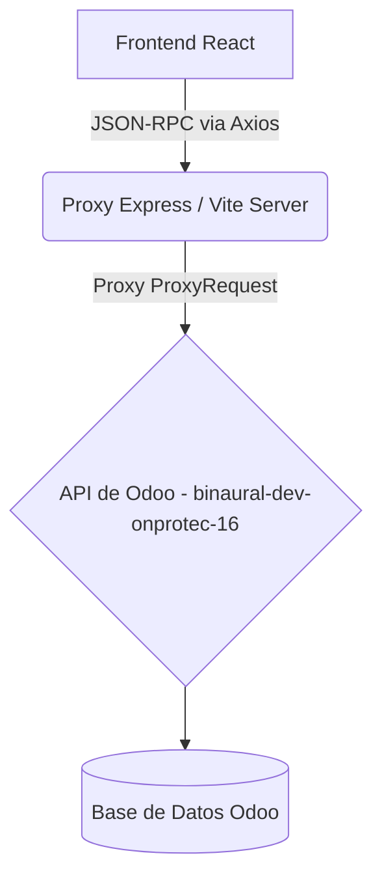

# Mapa Conceptual: Dashboard de Inventario (Odoo Inv xDias)

## 1. Propósito
Este proyecto es una aplicación web Frontend (React + Vite) diseñada para visualizar y analizar de manera avanzada los datos de inventario, ventas históricas y proveedores extraídos desde un servidor Odoo. El objetivo principal es determinar el nivel de inventario (en días) mediante análisis estadísticos de ventas.

## 2. Arquitectura General y Tecnologías
- **Frontend:** React, Vite, TypeScript, CSS Nativo (Variables, Flexbox/Grid).
- **Iconografía:** Lucide React.
- **Peticiones HTTP:** Axios.
- **Backend / Proxy:** Express.js (actúa como proxy reverso hacia Odoo en `/odoo_api`) para evitar bloqueos por CORS.
- **Integración:** API JSON-RPC de Odoo (v16).
- **Puertos:** Se estandarizó el uso del puerto `3006`.

## 3. Características Globales / UX-UI
- **Diseño Premium:** Se aplica una paleta oscura y profesional (Dark Mode) con colores como Índigo (`#4F46E5`) y Slate (`#1E293B`).
- **Estructura:** 
  - Sidebar izquierdo de navegación fija.
  - Header superior de contexto.
  - Grilla de estadísticas en la parte superior.
  - Paneles asimétricos inferiores para Listado de Ventas y Alertas de Inventario.
- **Feedback visual:** Pantalla de carga mientras se comunican las promesas de datos y "Error Banners" descriptivos si falla el acceso.

## 4. Detalle por Módulos y Lógica de Negocio

### OdooAPI (`src/api/OdooAPI.ts`)
Encapsula la lógica de comunicación con Odoo.
- `callKw`: Método base que envía peticiones `POST` a `/web/dataset/call_kw` estructuradas en el protocolo JSON-RPC 2.0.
- `getProviders()`: Lee del modelo `res.partner` filtrando por `supplier_rank > 0`.
- `getHistoricalSales()`: Lee de `account.move` filtrando facturas de cliente (`out_invoice`) que estén publicadas (`posted`).
- `getInventoryMetrics()`: Consulta `product.product` para traer las cantidades a mano y el stock virtual (`qty_available`, `virtual_available`).
